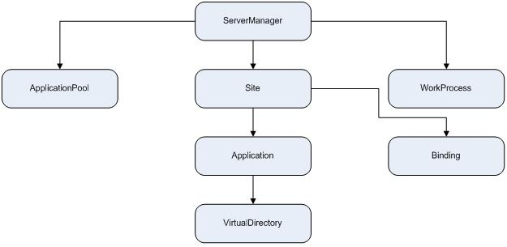

- [IIS develop in .NET | Microsoft Docs ](https://docs.microsoft.com/en-us/iis/develop/runtime-extensibility/extending-web-server-functionality-in-net)
- [Microsoft API 和参考目录 ](https://msdn.microsoft.com/library)

#Microsoft.Web.Administration

- [Microsoft.Web.Administration | Microsoft Docs ](https://docs.microsoft.com/en-us/iis/manage/provisioning-and-managing-iis/microsoftwebadministration)
- [How to Use Microsoft.Web.Administration | Microsoft Docs ](https://docs.microsoft.com/en-us/iis/manage/scripting/how-to-use-microsoftwebadministration)
- [Accessing Configuration Sections Using Microsoft.Web.Administration (MWA) | Microsoft Docs ](https://docs.microsoft.com/en-us/iis/manage/scripting/accessing-configuration-sections-using-microsoftwebadministration-mwa)
- [Microsoft.Web.Administration in IIS 7 – CarlosAg Blog ](https://blogs.msdn.microsoft.com/carlosag/2006/04/17/microsoft-web-administration-in-iis-7/)
- [Using C# to Manage IIS – Microsoft.Web.Administration Namespace « John Nelson's Blog ](https://johnlnelson.com/2014/06/15/the-microsoft-web-administration-namespace/)


#remove ApplicationPools
-[C# ServerManager IIs 7 - YangangwuWuyangang的专栏 - CSDN博客 ](http://blog.csdn.net/yangangwuwuyangang/article/details/40589251)

```csharp
ApplicationPool oldpool = iisManager.ApplicationPools[siteName + "Pool"];
if (oldpool != null)
{
    iisManager.ApplicationPools.Remove(oldpool);
    iisManager.CommitChanges();
}
```

- [Microsoft.Web.Administration in IIS 7 - 博客频道 - CSDN.NET ](http://blog.csdn.net/vince6799/article/details/7336220)

```cs
//创建站点
ServerManager iisManager = new ServerManager();  
iisManager.Sites.Add("1000seocom", "http", "*:80:", "d:\\1000seocom");  
iisManager.CommitChanges();   
//将一个应用程序（Application）添加到一个站点
ServerManager iisManager = new ServerManager();  
iisManager.Sites["1000seocom"].Applications.Add("/blog", "d:\\blog");  
iisManager.CommitChanges();  
//建立一个虚拟目录（Virtual Directory）
ServerManager iisManager = new ServerManager();  
Microsoft.Web.Administration.Application app = iisManager.Sites["1000seocom"].Applications["/blog"];  
app.VirtualDirectories.Add("/images", "d:\\virdir");  
iisManager.CommitChanges();   
//运行状态控制
//停止站点
ServerManager iisManager = new ServerManager();  
iisManager.Sites["1000seocom"].Stop();  
//启动站点
ServerManager iisManager = new ServerManager();  
iisManager.Sites["1000seocom"].Start();  
//回收应用程序池
ServerManager iisManager = new ServerManager();  
iisManager.ApplicationPools["DefaultAppPool"].Recycle();   
//得到当前正在处理的请求
ServerManager iisManager = new ServerManager();  
StringBuilder str = new StringBuilder();  
foreach (WorkerProcess w3wp in iisManager.WorkerProcesses)  
{  
   str.Append("W3WP  "+ w3wp.ProcessId+"\n");  
   foreach (Request request in w3wp.GetRequests(0))  
   {  
       str.Append(request.Url+ "-" +request.ClientIPAddr+" "+request.TimeElapsed+" "+request.TimeInState+"\n");  
   }  
}  
MessageBox.Show(str.ToString());  
```

# 创建一条龙

## 原理篇

- [Using Managed APIs in IIS 7 | Microsoft Docs ](https://docs.microsoft.com/en-us/iis/manage/provisioning-and-managing-iis/using-managed-apis-in-iis-7)



## 实战篇

- [Provisioning Sample in C# | Microsoft Docs ](https://docs.microsoft.com/en-us/iis/manage/provisioning-and-managing-iis/provisioning-sample-in-c#)

### 提供一个新的用户帐户


### 创建内容存储

Web站点需要配置保存用户上传文件的地址。Microsoft®。NET Directory类提供应用程序编程接口(API)在文件系统上创建目录。
```cs
Directory.CreateDirectory(parentPath + "\\" + directoryName);
```

内容存储需要配置特定的权限，以便用户能够管理自己的内容。下面的代码片段演示了如何使用C#中的管理代码来设置目录权限:

```cs
public static bool AddDirectorySecurity(string directoryPath, string userAccount, FileSystemRights rights, InheritanceFlags inheritanceFlags, PropagationFlags propagationFlags, AccessControlType controlType)
{
   try
   {
       // Create a new DirectoryInfo object.
       DirectoryInfo dInfo = new DirectoryInfo(directoryPath);
       // Get a DirectorySecurity object that represents the 
       // current security settings.
       DirectorySecurity dSecurity = dInfo.GetAccessControl();
       // Add the FileSystemAccessRule to the security settings. 
       dSecurity.AddAccessRule(new FileSystemAccessRule(userAccount, rights, inheritanceFlags, propagationFlags, controlType));
       // Set the new access settings.
       dInfo.SetAccessControl(dSecurity);
   }
   catch (Exception ex)
   {
       throw new Exception(ex.Message, ex);
   }
   return true;
}
```

下面的代码片段演示了怎样设置磁盘配额，如何使用，`管理代码(managed code)`设置磁盘配额。使用磁盘配额管理，必须添加`Windows®磁盘配额管理组件`引用，一般保存在Windows\system32\dskquota.dll。

```cs
public static bool AddUserDiskQuota(string userName, double quota, double quotaThreshold, string diskVolume)
{
   try
   {
      DiskQuotaControlClass diskQuotaCtrl = GetDiskQuotaControl(diskVolume);
      diskQuotaCtrl.UserNameResolution = UserNameResolutionConstants.dqResolveNone;
      DIDiskQuotaUser diskUser = diskQuotaCtrl.AddUser(userName);
      diskUser.QuotaLimit = quota;
      diskUser.QuotaThreshold = quotaThreshold;
    }
    catch (Exception ex)
    {
      throw new Exception(ex.Message, ex);
    }
    return true;
}
```

### Create an Application Pool
### Create a Site
### Create a Binding
### Create a Root Application
### Create a Virtual Directory
### Create an FTP Site

FTP站点允许用户将内容上传到网站上，并提供在Internet上移动文件的能力。客户可以管理内容和访问。FTP站点的创建与Web站点相似：创建应用程序池和站点，带有根应用程序和虚拟目录，然后绑定FTP。

```cs
public static bool CreateFtpSite(string applicationPoolName,string siteName, string domainName, string userName, string password,string contentPath, string ipAddress, string tcpPort, string hostHeader)
{
	try
	{
		//provision the application pool
		using (ServerManager mgr = new ServerManager())
		{
			ApplicationPool appPool = mgr.ApplicationPools[applicationPoolName];
			//per IIS7 team recommendation, we always create a new application pool
			//create new application pool
			if (appPool == null)
			{
				appPool = mgr.ApplicationPools.Add(applicationPoolName);
				//set the application pool attribute
				appPool.ProcessModel.IdentityType = ProcessModelIdentityType.SpecificUser;
				appPool.ProcessModel.UserName = domainName + "\\" + userName;
				appPool.ProcessModel.Password = password;
			}
			//if the appPool is null, we throw an exception. The appPool should be created or already exists.
			if (appPool == null)
				throw new Exception("Invalid Application Pool.");
			//if the site already exists, throw an exception
			if (mgr.Sites[siteName] != null)
				throw new Exception("Site already exists.");
			//create site
			Site newSite = mgr.Sites.CreateElement();                   
			newSite.Id = GenerateNewSiteID(mgr, siteName);
			newSite.SetAttributeValue("name", siteName);
			newSite.ServerAutoStart = true;
			mgr.Sites.Add(newSite);
			//create the default application for the site
			Application newApp = newSite.Applications.CreateElement();
			newApp.SetAttributeValue("path", "/"); //set to default root path
			newApp.SetAttributeValue("applicationPool", applicationPoolName);
			newSite.Applications.Add(newApp);
			//create the default virtual directory
			VirtualDirectory newVirtualDirectory = newApp.VirtualDirectories.CreateElement();
			newVirtualDirectory.SetAttributeValue("path", "/");
			newVirtualDirectory.SetAttributeValue("physicalPath", contentPath);
			newApp.VirtualDirectories.Add(newVirtualDirectory);
			//add the bindings 
			Binding binding = newSite.Bindings.CreateElement();
			binding.SetAttributeValue("protocol", "ftp");
			binding.SetAttributeValue("bindingInformation", ipAddress + ":" + tcpPort + ":" + hostHeader);
			newSite.Bindings.Add(binding);
			//commit the changes
			mgr.CommitChanges();
		}
	}
	catch (Exception ex)
	{
		throw new Exception(ex.Message, ex);
	}
	return true;
}
```

## 番外篇

- [Other Managed Code Samples | Microsoft Docs ](https://docs.microsoft.com/en-us/iis/manage/provisioning-and-managing-iis/other-managed-code-samples)

### 控制文件夹权限

```csharp
using System;
using System.IO;
using System.DirectoryServices;
using System.Security.AccessControl;
using System.Security.Principal;

class Program
{
    static void Main(string[] args)
    {
        String dir = @"e:\content";
        DirectorySecurity dirsec = Directory.GetAccessControl(dir);
        dirsec.SetAccessRuleProtection(true, false);
        foreach (AuthorizationRule rule in dirsec.GetAccessRules(true, true, typeof(NTAccount)))
        {
        dirsec.RemoveAccessRuleAll(new FileSystemAccessRule(rule.IdentityReference, FileSystemRights.FullControl, AccessControlType.Allow));
        }
    dirsec.AddAccessRule(new FileSystemAccessRule(@"BUILTIN\Administrators", FileSystemRights. FullControl,AccessControlType.Allow));
    dirsec.AddAccessRule(new FileSystemAccessRule(@"BUILTIN\Administrators", FileSystemRights.FullControl, InheritanceFlags.ObjectInherit, PropagationFlags.InheritOnly, AccessControlType.Allow));
    dirsec.AddAccessRule(new FileSystemAccessRule(@"BUILTIN\Administrators", FileSystemRights.FullControl, InheritanceFlags.ContainerInherit, PropagationFlags.InheritOnly, AccessControlType.Allow));
    Directory.SetAccessControl(dir, dirsec);
    }
}
```

### 创建用户

```csharp
using System;
using System.DirectoryServices;
class Program
{
    static void Main(string[] args)
    {
        DirectoryEntry AD = new DirectoryEntry("WinNT://" + Environment.MachineName + ",computer");
        DirectoryEntry NewUser = AD.Children.Add("PoolID1", "user");
        NewUser.Invoke("SetPassword", new object[] { "PoolIDPwd1" });
        NewUser.Invoke("Put", new object[] { "Description", "AppPool Account" });
        NewUser.CommitChanges();
    }
}
```